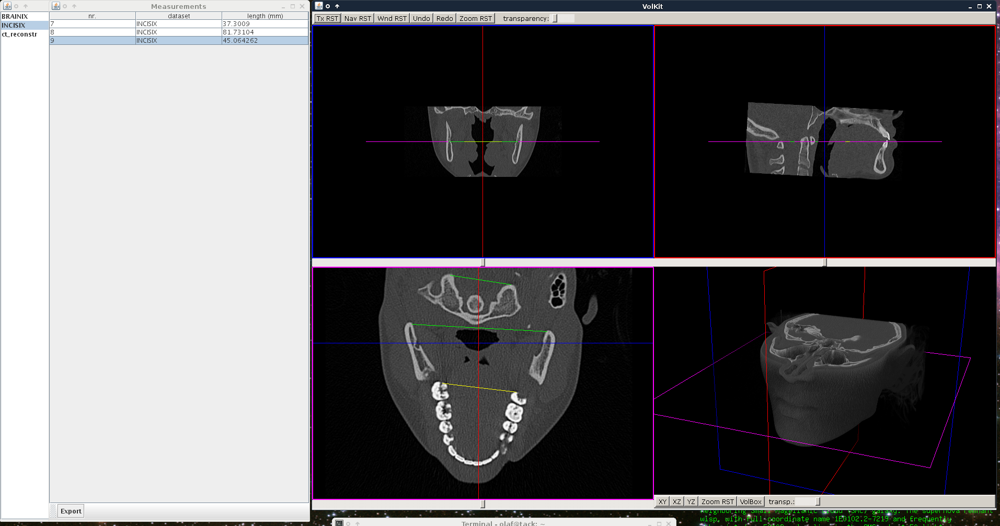

# VolKit

This is sort of an experimental toolbox containing slice and volume
renderers for medical (DICOM) image data sets, using
[LWJGL](http://lwjgl.org/). There is a frontend app to test it all
out. For the time being, you need to download and unpack the lwjgl
native binaries manually and point the `-Djava.library.path=` in
build.gradle to it (the other dependencies will be fetched by Gradle
automatically). In `app.properties`, set dataset.basedir to a
directory containing subdirectories containing sets of DICOM images
(one set per subdirectory). Go
[here](http://www.osirix-viewer.com/datasets/) for some sample
imagesets. After doing that, issue `gradle run`.

The UI is built on [TWL](http://twl.l33tlabs.org/). Right now there is
a domain model for datasets, 2D/3D viewer components for slices and
volumes with dynamically modifiable volume-world and
world-camera/slice coordinate transformations, and a simple viewer
plugin architecture for external parties that want to handle mouse
events and/or draw onto the viewer surface in a defined Z order.

I'm actually planning to port this thing to JS/WebGL (possibly using
C+emscripten for the visualization core) when I have time.

Sample screenshot:

